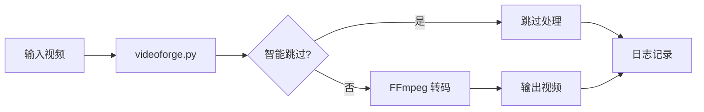

# VideoForge 项目结构

## 📂 目录结构

```
VideoForge/
├── 📄 核心文件
│   ├── videoforge.py              # 主程序（核心功能）
│   ├── config.json                # 配置文件（可选）
│   └── requirements.txt           # Python 依赖
│
├── 📖 文档文件
│   ├── README.md                  # 项目主文档
│   ├── CHANGELOG.md               # 版本更新记录
│   ├── QUICK_START.md             # 快速开始指南
│   └── PROJECT_STRUCTURE.md       # 本文件
│
├── 📁 examples/                   # 使用示例目录
│   ├── README.md                  # 示例说明文档
│   ├── process_nextcloud_videos.sh           # Nextcloud 视频转码（H.265）
│   ├── process_nextcloud_videos_h264.sh      # Nextcloud 视频转码（H.264）
│   └── process_driving_videos.sh             # 行车记录视频转码
│
├── 📁 tests/                      # 测试用例目录
│   ├── README.md                  # 测试说明文档
│   ├── test_resolution_detection.py   # 分辨率检测测试
│   ├── test_estimation.py             # 预估算法测试
│   ├── test_setup.sh                  # 环境检查测试
│   └── test_smart_skip.sh             # 智能跳过测试
│
├── 📁 docs/                       # 详细文档目录
│   ├── README.md                  # 文档导航
│   ├── 分辨率优化说明.md         # 2K/4K 支持和横竖屏识别
│   ├── 智能预估优化说明.md       # 预估算法详解
│   ├── 性能优化总结.md           # 性能优化历程
│   ├── 转码优化说明.md           # 转码参数指南
│   └── 转码进度报告.md           # 实际案例报告
│
├── 🔧 工具脚本
│   ├── check_status.sh            # 通用状态检查
│   ├── check_transcode_status.sh  # 转码状态监控
│   ├── watch_status.sh            # 实时状态监控
│   ├── monitor_progress.sh        # 进度监控
│   └── examples.sh                # 示例脚本
│
└── 📁 logs/                       # 日志目录（自动生成）
    ├── videoforge_YYYYMMDD.log    # 每日处理日志
    └── errors.log                 # 错误日志
```

## 📝 文件说明

### 核心文件

#### `videoforge.py`
**主程序文件**

- 包含所有核心功能类和方法
- 支持命令行参数解析
- 提供 transcode、merge、analyze 三大命令

**主要类**:
- `VideoForge`: 核心处理类
  - `transcode_video()`: 单文件转码
  - `transcode_directory()`: 批量转码
  - `merge_videos()`: 视频合并
  - `analyze_directory()`: 视频分析

**特性**:
- ✅ 智能跳过（预估转码效果）
- ✅ 2K/4K 分辨率支持
- ✅ 横竖屏自动识别
- ✅ 详细日志记录

#### `config.json`
**配置文件（可选）**

```json
{
  "default_codec": "h265",
  "default_quality": "medium",
  "default_preset": "medium",
  "video_extensions": [".mp4", ".MP4", ".avi", ".mov"],
  "skip_existing": true,
  "max_threads": 4
}
```

---

### 文档文件

#### `README.md`
**项目主文档**

- 项目简介和特性
- 快速开始指南
- 命令参数详解
- 使用示例

#### `CHANGELOG.md`
**版本更新记录**

- 每个版本的新功能
- Bug 修复记录
- 性能改进说明

#### `QUICK_START.md`
**快速开始指南**

- 5分钟上手教程
- 常见场景示例
- 常见问题解答

---

### examples/ 目录

#### `README.md`
**示例脚本说明文档**

- 每个脚本的详细说明
- 使用方法和参数
- 自定义脚本模板
- 实际场景案例

#### `process_nextcloud_videos.sh`
**Nextcloud 视频转码（H.265）**

```bash
#!/bin/bash
# 使用 H.265 编码处理 Nextcloud 视频
# 特点：高压缩率，节省空间
```

#### `process_nextcloud_videos_h264.sh`
**Nextcloud 视频转码（H.264）**

```bash
#!/bin/bash
# 使用 H.264 编码处理视频
# 特点：QuickTime 原生支持
```

#### `process_driving_videos.sh`
**行车记录视频转码**

```bash
#!/bin/bash
# 专门处理行车记录仪视频
# 特点：优化存储空间，保持可用质量
```

---

### tests/ 目录

#### `README.md`
**测试说明文档**

- 测试用例说明
- 运行方法
- 测试覆盖率
- 编写新测试指南

#### `test_resolution_detection.py`
**分辨率检测测试**

测试内容：
- ✅ 横屏视频识别
- ✅ 竖屏视频识别
- ✅ 2K/4K 分辨率识别
- ✅ 码率估算表验证

#### `test_estimation.py`
**预估算法测试**

测试内容：
- ✅ 文件大小预估
- ✅ 智能跳过逻辑
- ✅ 预估准确性

#### `test_setup.sh`
**环境检查测试**

检查项：
- ✅ FFmpeg 安装
- ✅ Python 版本
- ✅ 依赖库
- ✅ 基本功能

#### `test_smart_skip.sh`
**智能跳过测试**

测试场景：
- ✅ 低码率视频跳过
- ✅ 高码率视频转码
- ✅ 预估逻辑验证

---

### docs/ 目录

#### `README.md`
**文档导航**

- 文档目录索引
- 快速导航
- 按场景查找
- 按功能查找

#### `分辨率优化说明.md`
**2K/4K 支持和横竖屏识别**

内容：
- 新增 2K/4K 分辨率支持
- 短边判断算法
- 码率估算表
- 横竖屏自动适配

#### `智能预估优化说明.md`
**预估算法详解**

内容：
- 预估算法原理
- 实现细节
- 性能提升数据
- 使用示例

#### `性能优化总结.md`
**性能优化历程**

内容：
- 优化历程
- 各版本改进
- 实际效果对比
- 性能测试数据

#### `转码优化说明.md`
**转码参数指南**

内容：
- 参数选择建议
- 质量与大小平衡
- 不同场景推荐配置

#### `转码进度报告.md`
**实际案例报告**

内容：
- 实际转码任务记录
- 处理进度统计
- 问题和解决方案
- 经验总结

---

### 工具脚本

#### `check_status.sh`
**通用状态检查**

功能：
- 检查进程状态
- 显示 CPU/内存占用
- 统计处理进度

#### `check_transcode_status.sh`
**转码状态监控**

功能：
- 专门监控转码任务
- 详细的进度统计
- 输出目录信息

#### `watch_status.sh`
**实时状态监控**

功能：
- 自动刷新状态
- 实时显示进度

#### `monitor_progress.sh`
**进度监控**

功能：
- 监控处理进度
- 估算剩余时间

---

### logs/ 目录

#### 日志文件说明

**自动生成规则**：
- 日志目录：`<VideoForge项目目录>/logs/`
- 无论从哪里运行，都保存在项目目录
- 自动创建日志目录（如果不存在）

**日志文件**：

1. `videoforge_YYYYMMDD.log`
   - 每日处理日志
   - 包含所有处理信息
   - 自动按日期命名

2. `errors.log`
   - 错误日志
   - 只记录错误和警告
   - 用于问题排查

**日志格式**：
```
2025-11-09 20:07:18 - INFO - 📊 找到 4547 个视频文件
2025-11-09 20:07:18 - INFO - 📹 处理 [1/4547]: video.mp4
2025-11-09 20:07:18 - INFO - ⏭️  智能跳过: video.mp4 (原因)
2025-11-09 20:07:20 - INFO - 🔄 开始转码: video2.mp4
2025-11-09 20:10:15 - INFO - ✅ 转码完成: video2.mp4 (节省 45.2%)
```

---

## 🔄 工作流程

### 1. 基本使用流程



### 2. 目录组织原则

```
📂 用户空间
├── 源代码：       VideoForge/
├── 配置文件：     VideoForge/config.json
├── 使用示例：     VideoForge/examples/
├── 测试文件：     VideoForge/tests/
├── 文档资料：     VideoForge/docs/
├── 日志文件：     VideoForge/logs/
└── 临时文件：     自动清理
```

---

## 🛠️ 开发指南

### 添加新功能

1. **修改核心代码**: `videoforge.py`
2. **添加测试**: `tests/test_*.py` 或 `tests/test_*.sh`
3. **创建示例**: `examples/example_*.sh`
4. **编写文档**: `docs/新功能说明.md`
5. **更新日志**: `CHANGELOG.md`

### 目录使用规范

- **examples/**: 只放使用示例脚本，不放核心代码
- **tests/**: 只放测试文件，命名格式 `test_*.py` 或 `test_*.sh`
- **docs/**: 只放文档，使用 Markdown 格式
- **logs/**: 自动生成，不手动编辑

---

## 📊 文件统计

```
总文件数：约 30 个
├── Python 文件：   2 个 (videoforge.py + tests)
├── Shell 脚本：    8 个 (examples + 工具脚本)
├── Markdown 文档： 14 个 (README + docs)
├── 配置文件：      2 个 (config.json + requirements.txt)
└── 日志文件：      自动生成
```

---

## 🔗 快速链接

- **快速开始**: [QUICK_START.md](QUICK_START.md)
- **完整文档**: [README.md](README.md)
- **使用示例**: [examples/README.md](examples/README.md)
- **测试指南**: [tests/README.md](tests/README.md)
- **技术文档**: [docs/README.md](docs/README.md)
- **更新日志**: [CHANGELOG.md](CHANGELOG.md)

---

**维护者**: VideoForge Team  
**最后更新**: 2025-11-09  
**版本**: v2.2.0
